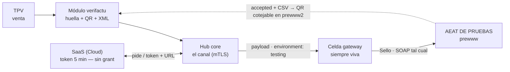
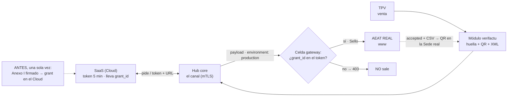

# Módulo `verifactu` — cumplimiento fiscal español (AEAT)

Capa de compliance **VeriFactu** (RD 1007/2023) sobre `invoice`: genera, **firma** y **transmite** a
la AEAT el registro de facturación de cada factura, lo **encadena** por SHA-256, gestiona la **cola
de contingencia** y valida la integridad de la cadena.

> ✳️ **ERPlora es SOLO VERI\*FACTU** (ADR-0271). La tabla `verifactu_event` de este módulo **no es**
> el registro de eventos regulatorio (que solo obliga a los SIF *no verificables*): es trazabilidad
> nuestra, voluntaria, y no convierte el producto en DUAL.

> **Module id:** `verifactu`. **Depende de:** `invoice`.
> **Motor fiscal = plugin NATIVO first-party** (ADR-0009): crate Rust **horneado en el runtime**, no
> un `handler.wasm` descargable — la cadena SHA-256, la firma PKCS#12, la TLS mutua y el XML SOAP
> exceden el sandbox WASM. Su acceso está **gateado por consentimiento** (ADR-0079): capabilities
> `certificate` + `network` (`https://*.aeat.es`), default-deny.

## Cómo viaja un registro a la AEAT — test y go-live

El camino es **el mismo** en pruebas y en producción; solo cambian dos cosas: qué entorno estampa
el módulo en el payload, y si el token del Cloud lleva el grant. El entorno lo decide **este
módulo** (su config, go-live de un solo sentido — guarda R1 de abajo); la celda gateway obedece al
payload y no distingue auras ni remitentes. *(Ruta gateway en implementación:
[hub#1432](https://github.com/ERPlora/hub/issues/1432) ·
[verifactu-gateway#42](https://github.com/ERPlora/verifactu-gateway/issues/42) ·
[saas#1794](https://github.com/ERPlora/saas/issues/1794). Un hub con **certificado propio**
transmite DIRECTO a la AEAT, sin celda — eso no cambia.)*

### Antes del go-live — todo va a la AEAT de pruebas



En test **no hace falta ningún grant**: el SaaS siempre acuña el token. Así funcionan PRE, la demo
y cualquier cliente que aún no ha hecho el go-live.

### Go-live — mismo camino, con la puerta del grant



| | Test | Go-live |
| --- | --- | --- |
| El módulo estampa en el payload | `environment: "testing"` | `environment: "production"` |
| El token del Cloud | se acuña siempre, sin requisitos | lleva `grant_id` (Anexo I firmado) |
| La celda entrega a | AEAT de pruebas (prewww) | AEAT real (www) — **solo con grant** |

🔒 **El go-live no tiene vuelta atrás**: es un interruptor de una sola dirección y, emitida la
primera factura o tique real, queda sellado para siempre (guarda **R1**: cualquier intento de
volver revierte la transacción entera). La celda no tiene interruptor propio: su única exigencia
es «production → grant», porque lo enviado a la AEAT real es irreversible.

## Documentación de usuario — [`docs/`](docs/)

Viaja **dentro** del módulo y se versiona con él: el asistente del hub (ADR-0282) la indexa por
versión instalada y cita la de TU versión, no la de la última publicada. En inglés (idioma fuente).

| Fichero | Para qué |
| ------- | -------- |
| [`docs/overview.md`](docs/overview.md) | Qué hace y qué NO hace; el vocabulario y la tarea de contingencia |
| [`docs/screens.md`](docs/screens.md) | Records / Contingency / Events / Recovery / Settings paso a paso |
| [`docs/concepts.md`](docs/concepts.md) | **Nada se anula** (rectificativa = `RegistroAlta` con importes negativos), producción y pruebas son **DOS cadenas**, el **go-live es de un solo sentido**, el certificado es del CORE |
| [`docs/limits.md`](docs/limits.md) | Rechazos reales (`verifactu.unsent_records`, `record_environment_unknown`…), backoff, permisos y diagnóstico |

## Las guardas que hay que conocer

| Guarda | Qué impide |
| ------ | ---------- |
| **R1 — go-live de un solo sentido** | Volver a `testing` con un registro de producción **aceptado**: no casa ninguna fila y el assert **revierte la transacción entera** |
| **R2 — retención** | Desactivar/desinstalar (o arrastrar en cascada) con registros sin remitir → `verifactu.unsent_records` (HTTP 409) |
| **R3 — sin `auto_transmit`** | Diferir la emisión: **módulo activo = siempre se emite** |
| **R4 — cadena por entorno** | Encadenar el primer registro de producción sobre la huella de uno de pruebas |
| **R5 — hub de demo** | Que una demo pase a `production` (clavado en el **core**, `demo_fiscal_environment_locked`) |
| **Cancelar contingencia** | Descartar un registro que la AEAT aún no tiene: solo si está `accepted` |

## Qué expone hoy

| Tipo | Nombre | Permiso |
| ---- | ------ | ------- |
| query | `verifactu.config.get` · `records.list` / `.get` / `.by_invoice` · `contingency.list` · `events.list` | `view_verifactu` |
| query | `verifactu.stats.*` (4 widgets) · `chain.status` · `diagnostics.last` · `aeat.records.list` | `view_verifactu` |
| command | `verifactu.records.create` / `.ingest_invoice` (nativo, listener) · `contingency.retry` / `.cancel` / `.process` | `manage_verifactu` |
| command | `verifactu.records.transmit` · `diagnostics.run` · `aeat.query_recent` (nativo) | `transmit_verifactu` |
| command | `verifactu.config.save` · `recovery.from_aeat` / `.manual` (nativo) | `configure_verifactu` (solo admin) |
| command | `verifactu.chain.validate` (nativo) | `view_verifactu` |
| escucha | `invoice.created` (F1–F3) · `invoice.rectified` (R1–R5) → `records.ingest_invoice` | — |
| tarea | `process_contingency` — `*/5 * * * *` (backoff 5·10·20·40·60 min) | — |
| emite | `verifactu.record.created/transmitted`, `contingency.*`, `config.changed`, `chain.*`, `aeat.queried`, `diagnostic.run` | — |

Navegación: `erp-verifactu-records`, `-contingency`, `-events`, `-recovery`, `-settings`.

## Layout

```text
module.json                   # manifest (contrato técnico) + capabilities + scheduled_tasks
migrations/postgres/          # esquema §2.5 + cadena por entorno + tabla guardia verifactu__gate
queries/*.sql                 # lecturas declarativas (:hub_id inyectado)
commands/*.sql                # escrituras declarativas (las `_` son intenciones del motor nativo)
ui/                           # Web Components (Lit/Ionic/OutfitKit)
docs/                         # documentación de usuario + corpus del asistente
```

> El motor fiscal **no vive aquí**: es un crate nativo del runtime del hub.

## Estado y trabajo abierto

El estado vive en las **Issues de este repo**, no aquí. Huecos documentados en `docs/limits.md`:
R1 **vive dentro del módulo** (se va con él) y solo cuenta `accepted`; las contraseñas de
certificado siguen **en claro**; y el «enviar prueba» standalone aún usa el emisor propio del módulo
en vez de la identidad global del hub.

Doc de arquitectura: `architecture/modules/verifactu.md` + diseño en
`architecture/saas/verifactu-gateway.md` (ADR-0202). Cargarlos antes de tocar el módulo.
